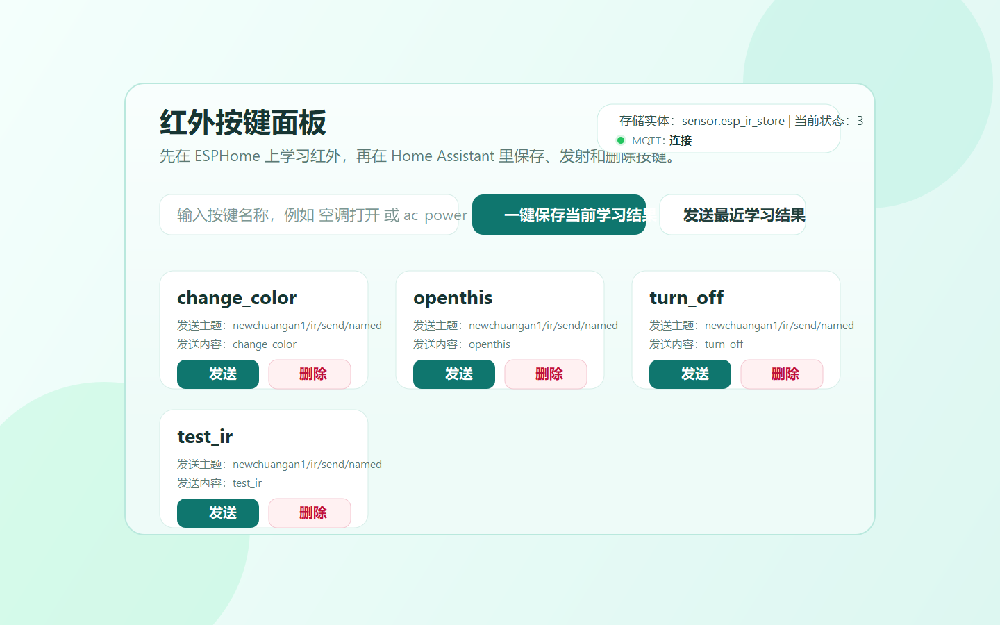

# ESP IR MQTT Card

English | [中文](#中文说明)

A Home Assistant custom Lovelace card for an ESPHome infrared bridge that stores learned keys in MQTT.

It automatically renders buttons from your saved key list and gives you a clean control surface to:

- send a saved key
- save the currently learned key with a new name
- delete a saved key
- send the last learned code



## Features

- HACS-compatible frontend repository
- Dynamic key buttons from MQTT-backed saved key store
- No hardcoded key list inside Lovelace
- Simple setup with Home Assistant `mqtt.publish`
- Works well with your ESPHome topics such as `newchuangan1/ir/...`

## Repository Layout

- `esp-ir-mqtt-card.js`: main Lovelace card
- `hacs.json`: HACS metadata
- `examples/home-assistant-mqtt.yaml`: MQTT entities for Home Assistant
- `examples/lovelace-card.yaml`: ready-to-paste card config
- `assets/card-preview.svg`: preview image
- `INSTALL.md`: quick install
- `CHANGELOG.md`: version history

## Install

### HACS

1. Open HACS.
2. Open `Custom repositories`.
3. Add:

```text
https://github.com/hxp830/esp-ir-mqtt-card
```

4. Category: `Dashboard`
5. Install `ESP IR MQTT Card`
6. Refresh your browser

### Manual

1. Copy `esp-ir-mqtt-card.js` to:

```text
/config/www/community/esp-ir-mqtt-card/esp-ir-mqtt-card.js
```

2. Add a dashboard resource:

```yaml
url: /local/community/esp-ir-mqtt-card/esp-ir-mqtt-card.js
type: module
```

## Home Assistant YAML

### 1. MQTT entities

Copy from [examples/home-assistant-mqtt.yaml](./examples/home-assistant-mqtt.yaml):

```yaml
mqtt:
  sensor:
    - name: ESP IR Store
      unique_id: esp_ir_store
      state_topic: "newchuangan1/ir/store"
      value_template: >
        
          {{ value_json | count }}
        
          0
        
      json_attributes_topic: "newchuangan1/ir/store"
    - name: ESP IR Last Learned
      unique_id: esp_ir_last_learned
      state_topic: "newchuangan1/ir/stored/last"

  binary_sensor:
    - name: ESP IR Device Online
      unique_id: esp_ir_device_online
      state_topic: "newchuangan1/status"
      payload_on: "online"
      payload_off: "offline"
```

### 2. Lovelace card

Copy from [examples/lovelace-card.yaml](./examples/lovelace-card.yaml):

```yaml
type: custom:esp-ir-mqtt-card
title: 红外按键面板
store_entity: sensor.esp_ir_store
topic_prefix: newchuangan1/ir
columns: 3
default_example_name: test_ir
```

## How It Works

The card publishes these MQTT commands through Home Assistant:

- `Save Current` -> `newchuangan1/ir/save_as`
- `Send` -> `newchuangan1/ir/send/named`
- `Delete` -> `newchuangan1/ir/delete`
- `Send Last` -> `newchuangan1/ir/send/last`

The dynamic button list comes from:

- `newchuangan1/ir/store`

which is mirrored into `sensor.esp_ir_store` as JSON attributes.

## Release

- Current version: `1.0.0`
- Release notes: [RELEASE_NOTES_v1.0.0.md](./RELEASE_NOTES_v1.0.0.md)
- Download package: create a zip from the repository root or use GitHub source download

## Notes

- The card depends on Home Assistant's `mqtt.publish` service.
- Your ESPHome infrared bridge must already be connected to the same MQTT broker.
- Saved buttons update automatically when the retained MQTT store changes.

---

## 中文说明

这是一个给 Home Assistant 使用的自定义 Lovelace 卡片，适合配合你的 ESPHome 红外网关一起使用。

它会根据 MQTT 里已经保存的红外键名，自动生成一组按钮，你可以直接在 Home Assistant 页面里：

- 发射已保存的按键
- 把“当前刚学习到的红外码”保存成名字
- 删除已保存按键
- 发射“最后一次学习到的红外码”

### 适用场景

如果你的 ESPHome 设备已经支持这些 MQTT 主题：

- `newchuangan1/ir/save_as`
- `newchuangan1/ir/send/named`
- `newchuangan1/ir/delete`
- `newchuangan1/ir/send/last`
- `newchuangan1/ir/store`

那么这张卡片就可以直接工作。

### 安装方式

#### HACS 安装

1. 打开 HACS
2. 进入 `Custom repositories`
3. 添加仓库：

```text
https://github.com/hxp830/esp-ir-mqtt-card
```

4. 类别选择 `Dashboard`
5. 安装后刷新浏览器

#### 手动安装

1. 把 `esp-ir-mqtt-card.js` 放到：

```text
/config/www/community/esp-ir-mqtt-card/esp-ir-mqtt-card.js
```

2. 在 Lovelace 资源中添加：

```yaml
url: /local/community/esp-ir-mqtt-card/esp-ir-mqtt-card.js
type: module
```

### Home Assistant 配置

先把下面这段加入 Home Assistant：

```yaml
mqtt:
  sensor:
    - name: ESP IR Store
      unique_id: esp_ir_store
      state_topic: "newchuangan1/ir/store"
      value_template: >
        
          {{ value_json | count }}
        
          0
        
      json_attributes_topic: "newchuangan1/ir/store"

    - name: ESP IR Last Learned
      unique_id: esp_ir_last_learned
      state_topic: "newchuangan1/ir/stored/last"

  binary_sensor:
    - name: ESP IR Device Online
      unique_id: esp_ir_device_online
      state_topic: "newchuangan1/status"
      payload_on: "online"
      payload_off: "offline"
```

然后在 Lovelace 卡片里添加：

```yaml
type: custom:esp-ir-mqtt-card
title: 红外按键面板
store_entity: sensor.esp_ir_store
topic_prefix: newchuangan1/ir
columns: 3
default_example_name: test_ir
```

### 工作原理

这张卡片会通过 Home Assistant 的 `mqtt.publish` 服务发送这些主题：

- 保存当前学习结果：`newchuangan1/ir/save_as`
- 按名字发射：`newchuangan1/ir/send/named`
- 删除按键：`newchuangan1/ir/delete`
- 发射最后学习结果：`newchuangan1/ir/send/last`

动态按钮列表来自：

- `newchuangan1/ir/store`

Home Assistant 会把这个 JSON topic 映射到 `sensor.esp_ir_store` 的 attributes，卡片再从这些 attributes 自动生成按钮。

如果卡片顶部显示：

```text
Store entity: sensor.esp_ir_store | State: unavailable
```

通常表示 `sensor.esp_ir_store` 还没有正确创建，或者 MQTT YAML 没有重载成功。此时先确认：

- `examples/home-assistant-mqtt.yaml` 已经按原样加入配置
- Home Assistant 已重载 MQTT 或已重启
- 开发者工具里能看到 `sensor.esp_ir_store`
- `sensor.esp_ir_store` 的 attributes 里包含你保存的键名，例如 `ac_power_on`
